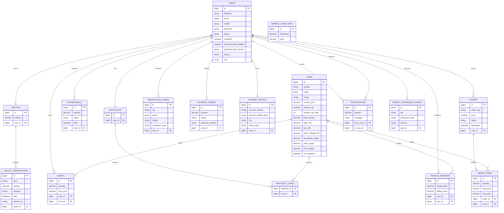

###  ** 🚀 TradeForge**

   **TradeForge** — A full-stack crypto trading platform built with Java, spring boot and react, 
       enabling users to buy, sell, and track cryptocurrencies in real times.

#### Database Design & Tables

#### **📋Tables and Relationships**

1. **👤 Users Table**
    - `id` (Primary Key)
    - `fullName`
    - `email`
    - `mobile`
    - `password`
    - `status`
    - `isVerified`
    - `twoFactorAuth_enabled`
    - `twoFactorAuth_sendTo`
    - `picture`
    - `role`

2. **🪙 Coins Table**
    - `id` (Primary Key)
    - `symbol`
    - `name`
    - `image`
    - `current_price`
    - `market_cap`
    - `market_cap_rank`
    - `fully_diluted_valuation`
    - `total_volume`
    - `high_24h`
    - `low_24h`
    - `price_change_24h`
    - `price_change_percentage_24h`
    - `market_cap_change_24h`
    - `market_cap_change_percentage_24h`
    - `circulating_supply`
    - `total_supply`
    - `max_supply`
    - `ath`
    - `ath_change_percentage`
    - `ath_date`
    - `atl`
    - `atl_change_percentage`
    - `atl_date`
    - `roi`
    - `last_updated`

3. **📦 Assets Table**
    - `id` (Primary Key)
    - `quantity`
    - `buy_price`
    - `coin_id` (Foreign Key → Coins)
    - `user_id` (Foreign Key → Users)

4. **💸 Withdrawals Table**
    - `id` (Primary Key)
    - `status`
    - `amount`
    - `user_id` (Foreign Key → Users)
    - `date`

5. **⭐ Watchlist Table**
    - `id` (Primary Key)
    - `user_id` (Foreign Key → Users)

6. **🔗 Watchlist_Coins Table**
    - `watchlist_id` (Foreign Key → Watchlists)
    - `coin_id` (Foreign Key → Coins)

7. **💳 WalletTransactions Table**
    - `id` (Primary Key)
    - `wallet_id` (Foreign Key → Wallets)
    - `type`
    - `date`
    - `transfer_id`
    - `purpose`
    - `amount`

8. **👛 Wallets Table**
    - `id` (Primary Key)
    - `user_id` (Foreign Key → Users)
    - `balance`

9. **🔐 VerificationCodes Table**
    - `id` (Primary Key)
    - `otp`
    - `user_id` (Foreign Key → Users)
    - `email`
    - `mobile`
    - `verification_type`

10. **📈 TradingHistories Table**
    - `id` (Primary Key)
    - `selling_price`
    - `buying_price`
    - `coin_id` (Foreign Key → Coins)
    - `user_id` (Foreign Key → Users)

11. **💰 PaymentOrders Table**
    - `id` (Primary Key)
    - `amount`
    - `status`
    - `payment_method`
    - `user_id` (Foreign Key → Users)

12. **🏦 PaymentDetails Table**
    - `id` (Primary Key)
    - `account_number`
    - `account_holder_name`
    - `ifsc`
    - `bank_name`
    - `user_id` (Foreign Key → Users)

13. **🛒 Orders Table**
    - `id` (Primary Key)
    - `user_id` (Foreign Key → Users)
    - `order_type`
    - `price`
    - `timestamp`
    - `status`
    - `order_item_id` (Foreign Key → OrderItems)

14. **📦 OrderItems Table**
    - `id` (Primary Key)
    - `quantity`
    - `coin_id` (Foreign Key → Coins)
    - `buy_price`
    - `sell_price`
    - `order_id` (Foreign Key → Orders)

15. **🔔 Notifications Table**
    - `id` (Primary Key)
    - `from_user_id` (Foreign Key → Users)
    - `to_user_id` (Foreign Key → Users)
    - `amount`
    - `message`

16. **📊 MarketChartData Table**
    - `id` (Primary Key)
    - `timestamp`
    - `price`

17. **🔑 ForgotPasswordTokens Table**
    - `id` (Primary Key)
    - `user_id` (Foreign Key → Users)
    - `otp`
    - `verification_type`
    - `send_to`

## 📊 ER Diagram

