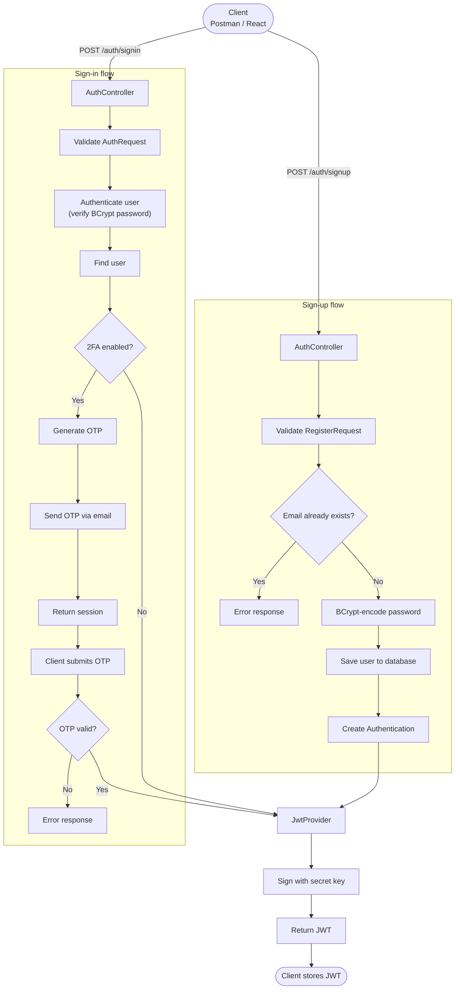
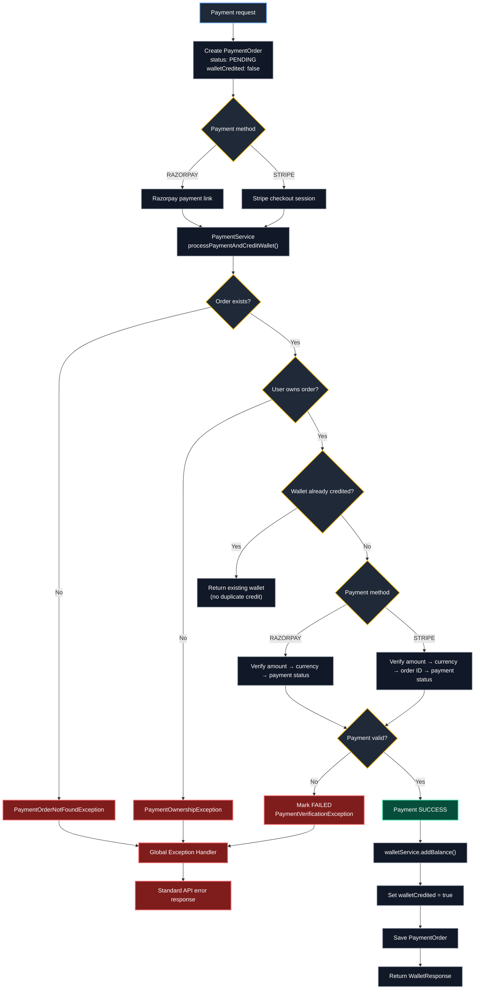
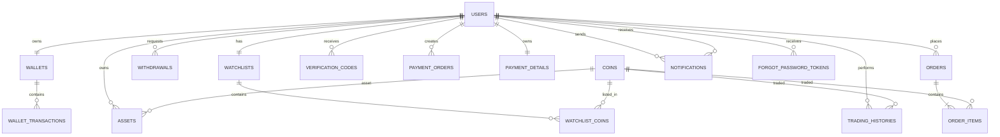

<div align="center">

# TradeForge ⚡

**A full-stack cryptocurrency trading and portfolio management platform.**

Execute trades, manage digital wallets, track real-time market data, and process secure fiat-to-crypto payments.

[](https://spring.io/projects/spring-boot)
[](https://reactjs.org/)
[](#-database-architecture)
[](#-security--authentication)
[](https://openjdk.org/)

</div>

---

## 📑 Table of Contents

- [Overview](#-overview)
- [Core Features](#-core-features)
- [Technology Stack](#-technology-stack)
- [Security & Authentication](#-security--authentication)
- [Payment Processing Engine](#-payment-processing-engine)
- [Database Architecture](#-database-architecture)
- [Getting Started](#-getting-started)
- [Configuration](#-configuration)
- [Project Structure](#-project-structure)
- [Roadmap](#-roadmap)

---

## 🔭 Overview

TradeForge is engineered for scale and correctness. It combines a stateless, secure authentication layer, a transactional order execution engine, a double-entry wallet ledger, and an idempotent multi-gateway payment pipeline behind a React-based trading terminal.

### Repositories

TradeForge is split across two repositories:

| Repository | Description |
| :--- | :--- |
| **[TradeForge](https://github.com/Biikash1/TradeForge)** (this repo) | Spring Boot backend: REST API, security, trading engine, wallet and payments |
| **[TradeForge-Frontend](https://github.com/Biikash1/TradeForge-Frontend)** | React + Redux + Tailwind CSS trading terminal |

---

## 🚀 Core Features

| Feature | Description |
| :--- | :--- |
| **Real-Time Market Tracking** | Live cryptocurrency pricing, market cap rankings, and historical chart data. |
| **Order Execution Engine** | Buy and sell orders with full order history and transactional integrity. |
| **Double-Entry Wallet System** | Internal ledger for user balances, top-ups, and withdrawal processing. |
| **Institutional-Grade Security** | Stateless JWT authentication, BCrypt password hashing, and OTP-based Two-Factor Authentication (2FA). |
| **Multi-Gateway Payments** | Idempotent fiat deposits via **Razorpay** and **Stripe** with automated wallet crediting. |
| **Watchlists & Portfolio** | Per-user watchlists and asset holdings with buy-price tracking. |

---

## 🛠️ Technology Stack

| Layer | Technologies |
| :--- | :--- |
| **Backend Core** | Java 21, Spring Boot, Spring Data JPA, Hibernate |
| **Frontend Terminal** | React, Redux (state management), Tailwind CSS |
| **Security** | Spring Security, JWT, BCrypt, OTP via Email |
| **Database** | MySQL |
| **Payment Gateways** | Razorpay API, Stripe API |

---

## 🔐 Security & Authentication

TradeForge uses a stateless authentication mechanism. Sign-in supports optional Two-Factor Authentication (2FA): when enabled, an OTP must be verified before the final JWT is issued.


```mermaid
flowchart TD
    C(["Client<br/>Postman / React"])

    C -->|"POST /auth/signup"| S1["AuthController"]
    C -->|"POST /auth/signin"| L1["AuthController"]

    subgraph SIGNUP ["Sign-up flow"]
        S1 --> S2["Validate RegisterRequest"]
        S2 --> S3{"Email already exists?"}
        S3 -->|Yes| SE["Error response"]
        S3 -->|No| S4["BCrypt-encode password"]
        S4 --> S5["Save user to database"]
        S5 --> S6["Create Authentication"]
    end

    subgraph SIGNIN ["Sign-in flow"]
        L1 --> L2["Validate AuthRequest"]
        L2 --> L3["Authenticate user<br/>(verify BCrypt password)"]
        L3 --> L4["Find user"]
        L4 --> L5{"2FA enabled?"}
        L5 -->|Yes| L6["Generate OTP"]
        L6 --> L7["Send OTP via email"]
        L7 --> L8["Return session"]
        L8 --> L9["Client submits OTP"]
        L9 --> L10{"OTP valid?"}
        L10 -->|No| LE["Error response"]
    end

    S6 --> J["JwtProvider"]
    L5 -->|No| J
    L10 -->|Yes| J

    J --> J1["Sign with secret key"]
    J1 --> J2["Return JWT"]
    J2 --> C2(["Client stores JWT"])
```

---

## 💳 Payment Processing Engine

The platform implements a resilient, **idempotent** payment engine. Internal wallets are credited only after successful verification with the payment provider, which prevents race conditions and duplicate credits.


```mermaid
flowchart TD
    A["Payment request"] --> B["Create PaymentOrder<br/>status: PENDING<br/>walletCredited: false"]
    B --> C{"Payment method"}

    C -->|RAZORPAY| D["Razorpay payment link"]
    C -->|STRIPE| E["Stripe checkout session"]

    D --> G["PaymentService<br/>processPaymentAndCreditWallet()"]
    E --> G

    G --> I{"Order exists?"}
    I -->|No| J["PaymentOrderNotFoundException"]
    I -->|Yes| L{"User owns order?"}
    L -->|No| M["PaymentOwnershipException"]
    L -->|Yes| O{"Wallet already credited?"}

    O -->|Yes| P["Return existing wallet<br/>(no duplicate credit)"]
    O -->|No| R{"Payment method"}

    R -->|RAZORPAY| S["Verify amount → currency → payment status"]
    R -->|STRIPE| T["Verify amount → currency → order ID → payment status"]

    S --> U{"Payment valid?"}
    T --> U

    U -->|No| V["Mark FAILED<br/>PaymentVerificationException"]
    U -->|Yes| W["Payment SUCCESS"]

    W --> X["walletService.addBalance()"]
    X --> Y["Set walletCredited = true"]
    Y --> Z["Save PaymentOrder"]
    Z --> AA["Return WalletResponse"]

    J --> AB["Global Exception Handler"]
    M --> AB
    V --> AB
    AB --> AC["Standard API error response"]

    classDef start fill:#1f2937,stroke:#60a5fa,stroke-width:2px,color:#fff;
    classDef process fill:#111827,stroke:#9ca3af,stroke-width:1.5px,color:#fff;
    classDef decision fill:#1f2937,stroke:#fbbf24,stroke-width:2px,color:#fff;
    classDef success fill:#064e3b,stroke:#34d399,stroke-width:2px,color:#fff;
    classDef error fill:#7f1d1d,stroke:#f87171,stroke-width:2px,color:#fff;

    class A start;
    class B,D,E,G,P,S,T,X,Y,Z,AA process;
    class C,I,L,O,R,U decision;
    class W success;
    class J,M,V,AB,AC error;
```

**Key guarantees**

- **Ownership check:** a user can only settle their own payment orders.
- **Idempotency:** the `walletCredited` flag guarantees a wallet is credited at most once per order.
- **Provider-side verification:** amount, currency, and payment status (plus order ID for Stripe) are verified before any balance change.
- **Centralized errors:** all failures flow through a global exception handler and return a standard API error response.

---

## 🗄️ Database Architecture

A fully normalized relational schema (3NF) of **17 tables** on MySQL, across five domains:

| Domain | Tables |
| :--- | :--- |
| **Identity & Security** | `USERS`, `VERIFICATION_CODES`, `FORGOT_PASSWORD_TOKENS` |
| **Market Data** | `COINS`, `WATCHLISTS`, `WATCHLIST_COINS`, `MARKET_CHART_DATA` |
| **Execution & Trading** | `ORDERS`, `ORDER_ITEMS`, `TRADING_HISTORIES`, `ASSETS` |
| **Finance & Ledger** | `WALLETS`, `WALLET_TRANSACTIONS`, `WITHDRAWALS`, `PAYMENT_ORDERS`, `PAYMENT_DETAILS` |
| **Communication** | `NOTIFICATIONS` |

### Key Entities

| Entity | Key Columns |
| :--- | :--- |
| **Users** | `id`, `fullName`, `email`, `mobile`, `password`, `status`, `isVerified`, `twoFactorAuth_enabled`, `twoFactorAuth_sendTo`, `picture`, `role` |
| **Coins** | `id`, `symbol`, `name`, `current_price`, `market_cap`, `total_volume`, `circulating_supply`, `ath`, `atl`, … (plus historical metrics) |
| **Assets (Holdings)** | `id`, `quantity`, `buy_price`, `coin_id`, `user_id` |
| **Wallets** | `id`, `user_id`, `balance` |
| **Wallet Transactions** | `id`, `wallet_id`, `type`, `amount`, `purpose`, `date` |
| **Orders** | `id`, `user_id`, `order_type`, `price`, `status`, `timestamp` |
| **Payments & Withdrawals** | Fiat deposits in `PAYMENT_ORDERS`; bank-linked account details in `PAYMENT_DETAILS` and `WITHDRAWALS` |

### Entity-Relationship Diagram


```mermaid
erDiagram
    USERS ||--|| WALLETS : owns
    WALLETS ||--o{ WALLET_TRANSACTIONS : contains
    USERS ||--o{ ASSETS : owns
    COINS ||--o{ ASSETS : asset
    USERS ||--o{ WITHDRAWALS : requests
    USERS ||--|| WATCHLISTS : has
    WATCHLISTS ||--o{ WATCHLIST_COINS : contains
    COINS ||--o{ WATCHLIST_COINS : listed_in
    USERS ||--o{ VERIFICATION_CODES : receives
    USERS ||--o{ TRADING_HISTORIES : performs
    COINS ||--o{ TRADING_HISTORIES : traded
    USERS ||--o{ PAYMENT_ORDERS : creates
    USERS ||--|| PAYMENT_DETAILS : owns
    USERS ||--o{ ORDERS : places
    ORDERS ||--|{ ORDER_ITEMS : contains
    COINS ||--o{ ORDER_ITEMS : traded
    USERS ||--o{ NOTIFICATIONS : sends
    USERS ||--o{ NOTIFICATIONS : receives
    USERS ||--o{ FORGOT_PASSWORD_TOKENS : receives
```

---

## 🏁 Getting Started

### Prerequisites

- Java 21+
- Maven 3.9+ (or the included wrapper)
- Node.js (LTS) and npm
- MySQL 8+
- Razorpay and/or Stripe test-mode accounts

### 1. Clone both repositories

```bash
# Backend
git clone https://github.com/Biikash1/TradeForge.git

# Frontend
git clone https://github.com/Biikash1/TradeForge-Frontend.git
```

### 2. Set up the database

```sql
CREATE DATABASE Trading;
```

> Tables are created by Hibernate on first run (`spring.jpa.hibernate.ddl-auto=update`), so no schema script is needed.

### 3. Run the backend

```bash
cd TradeForge
./mvnw clean install
./mvnw spring-boot:run
```

The API starts on `http://localhost:8080` by default.

### 4. Run the frontend

```bash
cd TradeForge-Frontend
npm install
npm run dev
```

The app starts on `http://localhost:5173` (Vite). Make sure the frontend's API base URL points to the running backend (see the [frontend README](https://github.com/Biikash1/TradeForge-Frontend)).

> **CORS:** if the frontend and backend run on different origins, allow the frontend origin in the backend's CORS configuration.

---

## ⚙️ Configuration

Never commit secrets. Provide them through environment variables or an untracked `application-local.properties`.

| Variable | Description |
| :--- | :--- |
| `DB_URL` | JDBC URL, e.g. `jdbc:mysql://localhost:3306/Trading` |
| `DB_USERNAME` / `DB_PASSWORD` | Database credentials |
| `JWT_SECRET` | Secret key used to sign JWTs (use a long, random value) |
| `JWT_EXPIRATION_MS` | Token lifetime in milliseconds |
| `MAIL_USERNAME` / `MAIL_PASSWORD` | SMTP credentials used to send OTP emails |
| `RAZORPAY_KEY_ID` / `RAZORPAY_KEY_SECRET` | Razorpay API credentials |
| `STRIPE_SECRET_KEY` | Stripe secret API key |
| `STRIPE_WEBHOOK_SECRET` | Stripe webhook signing secret |
| `COIN_API_KEY` | Market data provider key (if your provider requires one) |

> **Note:** variable names must match the keys used in your `application.properties`.

---

## 📁 Project Structure

This repository contains the backend only. The React frontend lives in [TradeForge-Frontend](https://github.com/Biikash1/TradeForge-Frontend).

```text
TradeForge/
├── src/main/java/…
│   ├── controller/           # REST controllers
│   ├── service/              # Business logic (payments, wallet, orders)
│   ├── repository/           # Spring Data JPA repositories
│   ├── model/                # JPA entities
│   ├── request/              # Request DTOs
│   ├── response/             # Response DTOs
│   ├── config/               # Security & JWT configuration
│   └── exception/            # Custom exceptions & global handler
├── src/main/resources/       # application.properties, static assets
├── pom.xml
└── README.md
```

---

## 🗺️ Roadmap

- [ ] Limit and stop-loss order types
- [ ] WebSocket-based live price streaming
- [ ] Portfolio analytics and P&L dashboards
- [ ] Dockerized deployment (Docker Compose)
- [ ] CI/CD pipeline and automated test coverage reports
